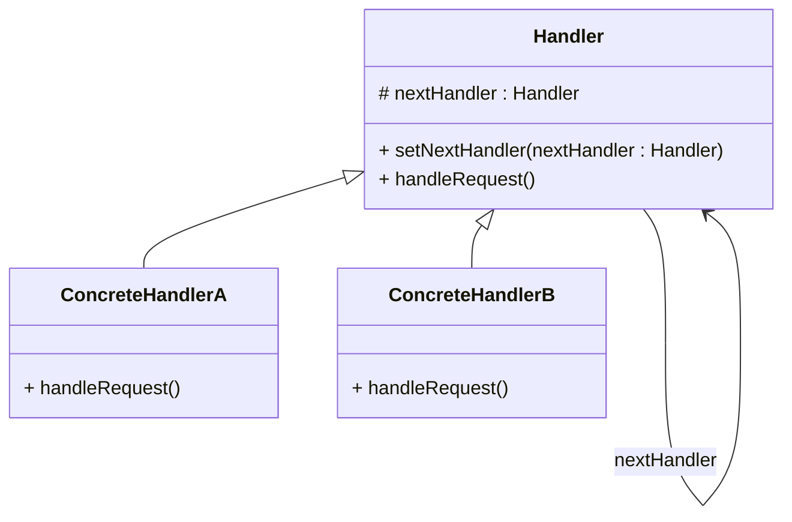

# Chain of Responsibility (Verantwortungskette bzw. Kette von Zuständigkeiten)
https://www.youtube.com/watch?v=jDX6x8qmjbA&list=PLF206E906175C7E07&index=22&pp=iAQB

Das Muster dient dazu, eine Anfrage durch eine Kette von Bearbeitern (Handlern) zu schicken. Jeder Bearbeiter entscheidet, ob er die Anfrage selbst bearbeiten kann – wenn nicht, gibt er sie an den nächsten in der Kette weiter.
## 🔧 Ziel: 
Die Sender der Anfrage müssen nicht wissen, welcher Bearbeiter zuständig ist. Dadurch wird der Code flexibler und entkoppelt.
## 🧠 Typische Einsatzszenarien
- Event-Handling in GUIs (z.B. Tastendruck wird von Komponenten weitergereicht)
- Logging-Systeme (verschiedene Logger für unterschiedliche Ebenen)
- Validierung von Formularen (mehrere Prüfregeln nacheinander)
## 📌 Vorteile
- Entkopplung von Sender und Empfänger
- Erweiterbarkeit: Neue Handler können leicht hinzugefügt werden
- Flexibilität: Reihenfolge der Bearbeiter kann angepasst werden

## UML
PlantUML-Code kann in IntelliJ dargestellt werden, nicht aber die Abbildung direkt in Markdown. Stattdessen muss man den Workaround machen, in dem man mittels einer .puml-Datei die Grafik erzeugt, diese als Bild speichert und anschließend in Markdown einbindet:

Mit Mermaid funktioniert es auch in IntelliJ direkt in Markdown integriert:

# Template Method
